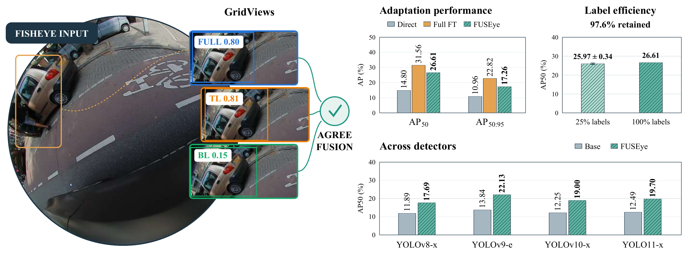

# FUSEye: Training-Light Fisheye Detection with Overlapping Views and Zero-Initialized Adapters

Official implementation of **FUSEye**. Submitted to ICRA 2027.

[Overview](#overview) · [Method](#method) · [Results](#results) ·
[Installation](#installation) · [Checkpoints](#checkpoints) · [Data](#data) ·
[Evaluation](#evaluate-the-released-model) · [Training](#train-from-the-coco-checkpoint)

## Overview

Fisheye distortion and boundary compression make COCO-pretrained detectors
less effective on wide-angle images. FUSEye adapts YOLO26-x to this setting
with overlapping image views, zero-initialized residual adapters, and learned
agreement-based detection fusion. It requires no camera calibration or dewarping.



*Motivation and paper-reported results of FUSEye. GridViews exposes the same
boundary object in overlapping views, and AgreeFusion combines the resulting
detection evidence. The charts summarize full-data adaptation, limited-label
training, and experiments across YOLO detectors. The illustration is taken from
the manuscript; the accompanying code release targets YOLO26-x.*

### Release status

| Item | Status |
|---|---|
| YOLO26-x source implementation | Included in this repository |
| Trained checkpoints | Packaged separately as `FUSEye-weights.zip`; see [Checkpoints](#checkpoints) |
| Full MVR inference verification | 2,145 images, matching the reported final metrics; see [validation](docs/VALIDATION.md) |
| Training entry points | Detector and scorer training passed small-scale execution checks |
| Complete retraining verification | The eight-epoch training experiment was not rerun during release preparation |
| Dataset | External; images and labels are not distributed here |

## Method

FUSEye processes the full image and four corner crops with the same adapted
detector, remaps their predictions to the original image coordinates, and
combines consistent detections. The implementation names M1/M2/M3 map to the
paper components as follows:

| Experiment name | Paper name | Function |
|---|---|---|
| M1 | Z-Adapters | Zero-initialized residual adapters at detector layers 6, 8 and 10 |
| M2 | GridViews | Full image and four overlapping corner crops |
| M3 | AgreeFusion | Learned scoring and box fusion using agreement across views |

The detector backbone parameters are frozen. **The existing detection head
is trained together with the adapters.** The fusion scorer is trained in a
separate stage. There are 226,865 newly introduced parameters and 6,667,817
parameters optimized across the two stages.

This repository contains the final **YOLO26-x** implementation. It does not
claim to include all detector families or baselines discussed in the paper.
See [reproduction notes](docs/REPRODUCIBILITY.md) for implementation details,
the original training population, BatchNorm behavior, and baseline differences.

GridViews uses 857x647 crops for a 1280x966 image and resizes each view to
640x640. Z-Adapters start as exact identity mappings. AgreeFusion groups
same-class candidates at IoU 0.5, preserves a confidence threshold of 0.25 for
single-view clusters, and uses a learned scorer for clusters supported by at
least two distinct views. Confidence-weighted box fusion is followed by
class-wise NMS. Details of the scoring and dispersion rules are documented
in [REPRODUCIBILITY.md](docs/REPRODUCIBILITY.md).

## Results

### Main comparison on WoodScape MVR

The following table contains **paper-reported results** for YOLO26-x. Values
are percentages. During release preparation, fresh inference reproduced the
FUSEye row; the other two rows are manuscript reference results and were not
rerun as part of that verification.

| Method | AP50 | AP50:95 | Car AP50:95 | Person AP50:95 | Bus AP50:95 |
|---|---:|---:|---:|---:|---:|
| Direct transfer | 14.80 | 10.96 | 15.74 | 15.67 | 1.49 |
| **FUSEye** | **26.61** | **17.26** | **26.83** | **24.06** | **0.87** |
| Full fine-tuning | 31.56 | 22.82 | 42.48 | 22.44 | 3.54 |

FUSEye retains 84.3% of the full-fine-tuning AP50 in this comparison. The gains
are not uniform across categories: bus AP50:95 remains low and is below the
direct-transfer result.

### Limited-label performance

| Labeled training setting | AP50 | AP50:95 |
|---|---:|---:|
| 25%, three subsets of 1,520 images | 25.97 ± 0.34 | 16.84 ± 0.25 |
| Full-data experiment | 26.61 | 17.26 |

The 25% values are the mean and sample standard deviation over three subsets,
retaining 97.6% of full-data AP50 on average. The original subset manifests
and result records are included. These subset training runs were not repeated
during release preparation. See [Limited-label experiments](#limited-label-experiments)
for the commands and [reproduction notes](docs/REPRODUCIBILITY.md) for the
distinction between 6,089 total training images and 6,082 target-containing images.

The component ablation table appears in [Evaluation](#evaluate-the-released-model).

## Installation

The recorded experiment environment is Ubuntu 22.04, Python 3.12, an NVIDIA
RTX 4090, PyTorch 2.9.1+cu130, torchvision 0.24.1+cu130, and Ultralytics 8.4.95.
Exact installed package versions are in [server_environment.json](docs/server_environment.json).

```bash
conda create -n fuseye python=3.12 -y
conda activate fuseye
python -m pip install torch==2.9.1 torchvision==0.24.1 --index-url https://download.pytorch.org/whl/cu130
python -m pip install -r requirements.txt
python -m pip install -e . --no-deps
```

Run the commands below from the repository root. The CUDA build above requires
a compatible NVIDIA driver. If using a different supported PyTorch build,
record it with your results; numerical equivalence has not been established
across all platforms.

## Checkpoints

Place these files in `weights/`:

```text
weights/
  yolo26x.pt                           # Original COCO-pretrained base
  m1_adapters.pt                       # Trained Z-Adapters
  detect_head.pt                       # Trained COCO detection head
  m3_v5_agreement_scorer_finalM1.pt      # Final AgreeFusion scorer
```

All four checkpoints, including the exact original base used by the experiment,
are in the accompanying `FUSEye-weights.zip`. Extract that archive into
`weights/`. To obtain an alternative copy of the official base through
Ultralytics, use:

```bash
python -c "from ultralytics import YOLO; YOLO('yolo26x.pt')"
mv yolo26x.pt weights/yolo26x.pt
```

Compare its SHA-256 with [weights/SHA256.json](weights/SHA256.json). An upstream
download can change, so exact historical reproduction requires the recorded
file hash. Do not replace the 80-class head with a new three-class head.
See [checkpoint notes](weights/README.md). Download the verified
[FUSEye-weights.zip](https://github.com/Su-wenya/FUSEye/releases/download/v0.1.0/FUSEye-weights.zip)
from the [v0.1.0 release](https://github.com/Su-wenya/FUSEye/releases/tag/v0.1.0).

```bash
python -m fuseye.verify --weights weights
```

## Data

Obtain WoodScape under its dataset terms. Images and annotations are not
distributed here. This implementation expects **YOLO-format** labels:

```text
class_id center_x center_y width height
```

Coordinates are normalized to the original image. Target IDs must be
**0=car, 1=person, 2=bus**. Other class IDs are ignored by training and
evaluation. Internally, targets map to COCO IDs car=2, person=0, bus=5.

Expected layout:

```text
data/woodscape/
  images/train/    # FV, RV, MVL images
  images/val/      # MVR images
  labels/train/   # Same stems as images
  labels/val/
```

Images must be 1280x966. The final experiment has **6,089 training images**
(6,082 containing target objects) and **2,145 validation images**.
The exact filename lists are in `splits/train_full.json` and
`splits/val_mvr.json`. Keep validation images without target objects so that
their false positives are counted.

If you already have flat image and YOLO-label directories, build this layout:

```bash
python -m fuseye.prepare_data --images /path/to/images --labels /path/to/yolo_labels --out data/woodscape
```

This creates image symlinks and copies labels. Add `--copy` to copy images.
Filenames must end in `_FV`, `_RV`, `_MVL` or `_MVR` before the extension.
This command does not convert an unspecified raw annotation format.

## Evaluate the released model

```bash
python -m fuseye.cli evaluate --data data/woodscape --manifest splits/val_mvr.json --base weights/yolo26x.pt --weights weights --out runs/evaluation
```

This performs fresh five-view inference and writes `predictions.json` and
`metrics.json`. Add `--limit 3` for a quick smoke test, or `--ablation` to
evaluate all eight module combinations. A limited run is not a full benchmark.

Fresh full-validation inference matches the historical results below at the
reported precision. See [validation evidence](docs/VALIDATION.md).
Numbers are percentages;
class columns report AP50:95. Machine-readable records are in
[reported_ablation.json](results/reported_ablation.json).

| Configuration | AP50 | AP50:95 | Car | Person | Bus |
|---|---:|---:|---:|---:|---:|
| Baseline, ablation protocol | 14.62 | 11.05 | 15.63 | 16.27 | 1.25 |
| M1 | 17.75 | 13.01 | 20.37 | 17.76 | 0.89 |
| M2 | 15.49 | 11.22 | 13.60 | 18.51 | 1.55 |
| M3 | 14.62 | 11.05 | 15.63 | 16.27 | 1.25 |
| M1 + M2 | 20.39 | 14.03 | 19.74 | 21.45 | 0.89 |
| M1 + M3 | 17.75 | 13.01 | 20.37 | 17.76 | 0.89 |
| M2 + M3 | 18.91 | 12.95 | 17.36 | 20.43 | 1.06 |
| **M1 + M2 + M3** | **26.61** | **17.26** | **26.83** | **24.06** | **0.87** |

The 14.62 baseline is the matching ablation baseline. It is not the paper's
separately evaluated 14.80 direct-transfer result.

## Train from the COCO checkpoint

### 1. Train Z-Adapters and the detection head

```bash
python -m fuseye.train_detector --data data/woodscape --manifest splits/train_full.json --base weights/yolo26x.pt --out runs/full/weights --epochs 8 --batch-size 8 --seed 0
```

This uses Adam, adapter learning rate 1e-4, head learning rate 5e-5, cosine
decay per batch, and gradient clipping at 10. It trains on full images resized
to 640x640, without adding crop augmentation. It saves adapters, the detection
head, training history, and the actual image manifest.

The original full-data run did not record a fixed seed. This command implements
its training recipe, but bit-identical retraining is not promised.

### 2. Generate training candidates

```bash
python -m fuseye.cli collect --data data/woodscape --split train --manifest runs/full/weights/train_manifest.json --base weights/yolo26x.pt --weights runs/full/weights --out runs/full/train_candidates.json
```

Each original image yields five views. Per-view candidate confidence is 0.02.
The candidate file records the split and checkpoint hashes. Always generate
a new candidate file after changing the model, split, or preprocessing.

### 3. Train AgreeFusion

```bash
python -m fuseye.cli train-scorer --data data/woodscape --cache runs/full/train_candidates.json --out runs/full/weights/m3_v5_agreement_scorer_finalM1.pt --epochs 8 --seed 3
```

The scorer has 12 input features and hidden widths 96 and 32, with dropout 0.2.
It uses AdamW (lr=1e-3, weight decay=1e-4), batch size 2048, class-weighted BCE
and a pairwise ranking term. Only training candidates and training annotations
are used to fit it.

### 4. Evaluate the newly trained model

```bash
python -m fuseye.cli evaluate --data data/woodscape --manifest splits/val_mvr.json --base weights/yolo26x.pt --weights runs/full/weights --out runs/full/evaluation
```

## Limited-label experiments

Use `splits/train_fraction25_seed0.json`, `splits/train_fraction25_seed1.json`,
or `splits/train_fraction25_seed2.json`. Each contains the original
1,520 selected image stems. For example:

```bash
python -m fuseye.train_detector --data data/woodscape --manifest splits/train_fraction25_seed0.json --base weights/yolo26x.pt --out runs/fraction25_seed0/weights --seed 0
```

Then repeat candidate collection, scorer training and evaluation above with
the new weights directory and **its generated `train_manifest.json`**. This
ensures the detector and scorer use the same labeled subset. Detector seeds
are 0, 1 and 2 respectively; the scorer seed remains 3. The historical subset
results are provided in `results/reported_fraction25_seed*.json`.

## Repository structure

```text
assets/             Manuscript teaser image
fuseye/             Adapters, view inference, fusion, training, and evaluation
docs/               Reproduction notes, environment, provenance, and validation
results/            Historical result records and release-validation evidence
splits/             Full-data and limited-label image manifests
weights/            Checkpoint instructions and SHA-256 values
requirements.txt    Recorded dependency versions
```

The checkpoint binaries are distributed separately from the source archive.
For command-line options:

```bash
python -m fuseye.prepare_data --help
python -m fuseye.train_detector --help
python -m fuseye.cli --help
python -m fuseye.verify --help
```

## Acknowledgments

This implementation builds on Ultralytics YOLO and PyTorch, uses pycocotools
for evaluation, and evaluates on WoodScape. These projects and assets retain
their respective licenses and terms. See [NOTICE](NOTICE).

## Contact

For questions about the implementation or reproduction, please open an issue
in this repository. Include the command, environment versions, checkpoint
hashes, and relevant error output so the result can be investigated.

## License

The code is released under [AGPL-3.0](LICENSE). Ultralytics and WoodScape retain
their respective terms. See [NOTICE](NOTICE). This repository contains no
dataset redistribution or publisher PDF, and makes no claim that the paper
has been accepted.
